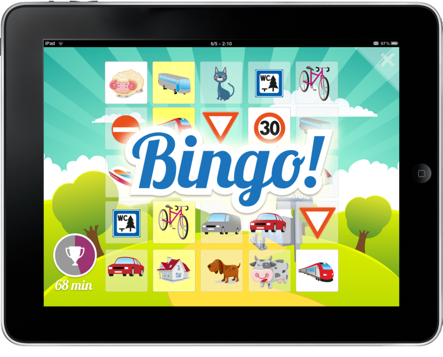

!SLIDE subsection

# Backbone.js

!SLIDE red

# Models

!SLIDE

    @@@ javascript
    Tile = Backbone.Model.extend({
      ..
    })

    Grid = Backbone.Model.extend({
      ..
    })

    Game = Backbone.Model.extend({
      ..
    })

!SLIDE red

# Views

!SLIDE center

!SLIDE

    @@@ javascript
    CB.TileView = Backbone.View.extend({
      className: "tile",
      template: _.template(
        "\" />"),

      initialize: function(options) {
        this.model.on("change:toggled",
          this.setToggleClass, this);
      },
      ..
    })

!SLIDE

    @@@ javascript
    render: function() {
      this.$el.html(
        this.template(this.model.toJSON()));
      return this;
    }

!SLIDE red

# Events

!SLIDE

    @@@ javascript
    Events.bind("bingo", function() {
      $(".game .bingo").fadeIn(100, function() {
        setTimeout(function() {
          $(".game .bingo").fadeOut(400);
        }, 900);
      });
      sounds["yeah"].play();
    });

!SLIDE red

# Jasmine

!SLIDE

    @@@ javascript
    it("should know if the game is finished",
    function() {
      expect(game.isGameFinished()).toBe(false);

      _.each(game.grid.tiles(), function(tile) {
        CB.vent.trigger("tick", tile);
      });

      expect(game.isGameFinished()).toBe(true);
    });
