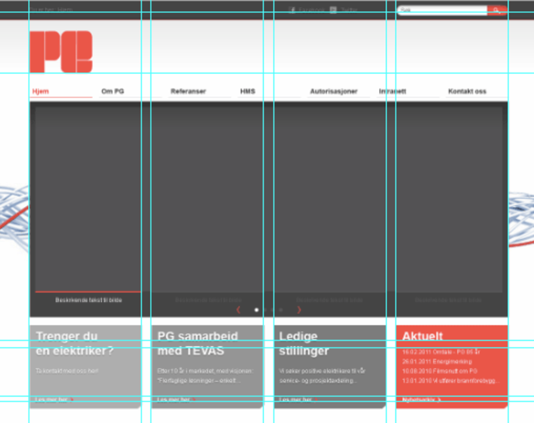
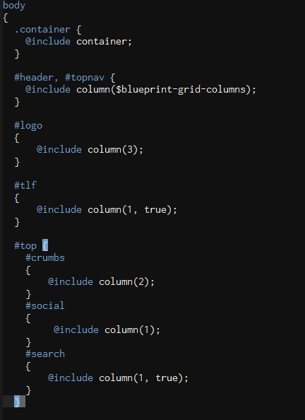

!SLIDE subsection
# Eksempler

!SLIDE

# Partials

!SLIDE center

!SLIDE
# Variabler

!SLIDE

    @@@ css
    $body-text: #bbb;
    $strong-text: darken($body-text, 40%);
    $muted-text: lighten($body-text, 30%);

!SLIDE
# Nøsting

!SLIDE

    @@@ css
    .annonse {
      float: left;

      span {
        text-transform: uppercase;
        color: $annonsetekst;
      }
    }

!SLIDE
# Mixins

!SLIDE

    @@@css
    @mixin horizontal-list($spacing: 10px) {
      li {
        float: left;
        margin-right: $spacing;
      }
    }

!SLIDE

    @@@css
    #header ul.nav {
      @include horizontal-list;
      float: right;
    }

    #footer ul.nav {
      @include horizontal-list(20px);
      margin-top: 1em;
    }

!SLIDE
# CSS 3

!SLIDE

    @@@css
    .rounded {
      @include border-radius(4px, 4px);
    }

!SLIDE

    @@@css
    .rounded {
      -webkit-border-radius: 4px 4px;
      -moz-border-radius: 4px / 4px;
      -o-border-radius: 4px / 4px;
      -ms-border-radius: 4px / 4px;
      -khtml-border-radius: 4px / 4px;
      border-radius: 4px / 4px;
    }

!SLIDE

    @@@css
    h2 {
      @include opacity(50);
    }

!SLIDE

    @@@css
    h2 {
      opacity: 0.5;
      -moz-opacity: 0.5;
      -khtml-opacity: 0.5;
      -ms-filter: DXImageTransform osv;
      filter: alpha(opacity=50);
    }

!SLIDE
# Grids

!SLIDE

    @@@css
    $blueprint-grid-columns: 24;
    $blueprint-grid-width:   30px;
    $blueprint-grid-margin:  10px;

!SLIDE center

!SLIDE center

